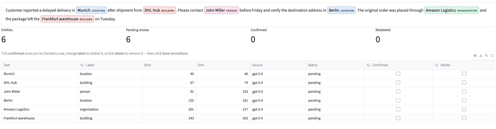

# GenAI Annotation Studio

[](https://github.com/smaoui-me/genai-nlp-eval-framework-1-/actions/workflows/ci.yml)
[](https://www.python.org/)
[](https://streamlit.io/)
[](LICENSE)

A configurable human-in-the-loop application for LLM-assisted entity
extraction, ticket routing, annotation review, and traceable gold-data export.
It combines an interactive Streamlit product with reproducible evaluation
utilities for measuring model quality before deployment.



## Why this project exists

LLMs can generate plausible annotations, but plausible output is not ground
truth. GenAI Annotation Studio keeps model suggestions separate from human
decisions, records every correction, and exports both prediction provenance and
reviewed labels. Teams can adapt the same workflow to support tickets,
scientific documents, or another text domain without changing application code.

## Features

- **Configurable extraction:** define labels, descriptions, and domain guidance
  in reusable YAML files.
- **Editable prompting:** inspect and modify the generated extraction and
  classification prompts before inference.
- **Flexible input:** annotate pasted text, TXT, PDF, or a mapped CSV row.
- **Two routing strategies:** choose an LLM classifier or a local
  similarity-weighted embedding classifier built from reviewed examples.
- **Human review:** confirm, relabel, delete, resize, or add entity spans and
  approve or correct routing decisions.
- **Auditable exports:** preserve raw predictions, final gold entities, prompt
  hashes, token usage, model metadata, and review history in JSON.
- **Document-scale execution:** process complete documents sentence by sentence
  with stable document offsets and restartable batch evaluation.
- **Reproducible validation:** run network-free tests and benchmark extraction
  or classification independently from inference.

## Quick start

Requirements: Docker Engine with Docker Compose v2.

```bash
cp .env.example .env
# Add your hosted LLM settings to .env, or use the local Ollama option.
docker compose up --build
```

Open <http://localhost:8501>. The interface works without credentials; LLM
actions are enabled after a hosted OpenAI-compatible endpoint or local Ollama
model is configured.

Reviewed exports are persisted at:

```text
genai-nlp-annotation-tool/data/gold_exports/
```

See [QUICKSTART.md](QUICKSTART.md) for the complete walkthrough and
[docs/TESTING.md](docs/TESTING.md) for end-to-end validation.

## Typical workflow

```text
Text / PDF / CSV
       |
       v
Optional routing ------> LLM prompt or local embedding index
       |
       v
LLM entity suggestions
       |
       v
Human confirmation and correction
       |
       v
Reviewed JSON + provenance + evaluation data
```

Uploaded raw text does not contain hidden gold labels. Gold data is created
only through reviewer approval or imported from an independently annotated
benchmark.

## Use your own domain

1. Copy a template under
   `genai-nlp-annotation-tool/config/use_cases/`.
2. Define the use-case name, entity labels, label definitions, domain guidance,
   and optional routing departments.
3. Restart the application and select the new use case.
4. Inspect the generated prompt, run pre-annotation, and review every suggestion.

No Python changes are required for a new extraction schema.

## Local embedding routing

The local classifier embeds the current ticket, retrieves similar reviewed
tickets, and applies a similarity-weighted department vote. It does not train or
fine-tune a model and makes no routing LLM call. The export records the encoder,
reference-data hash, neighbors, similarities, confidence, prediction, and human
decision.

Use the synthetic reference set in
`sample_data/classification/embedding_demo/` for a first run. For a real use
case, keep reference, development, and held-out test data separate to prevent
leakage. The complete workflow is documented in
[docs/classification/EMBEDDING_RETRIEVAL.md](docs/classification/EMBEDDING_RETRIEVAL.md).

## Run tests

The default test suite does not call external models:

```bash
docker compose --profile test run --rm test
```

For local Python development:

```bash
python -m venv .venv
python -m pip install -r requirements-dev.txt
python -m pytest -q
```

## Optional evaluation pipelines

The repository retains reproducible extraction and classification benchmarks as
supporting infrastructure. They are not required to run the annotation product.

```bash
docker compose --profile tools build evaluation
docker compose --profile tools run --rm evaluation \
  python scripts/annotation/check_scirex_study_readiness.py
```

SciREX demonstrates document-scale extraction and checkpoint recovery;
Few-NERD provides token-level extraction fixtures; synthetic support tickets
exercise classification and evidence validation. Dataset sources, licenses, and
reconstruction commands are documented in [data/README.md](data/README.md).

## Project structure

| Path | Purpose |
|---|---|
| `genai-nlp-annotation-tool/` | Streamlit application, use-case templates, and product tests |
| `src/genai_eval/` | Reusable preprocessing, retrieval, and evaluation modules |
| `sample_data/` | Synthetic examples for safe local testing |
| `configs/` and `prompts/` | Versioned evaluation configurations and prompts |
| `scripts/` | Reproducible extraction, classification, and dataset utilities |
| `docs/` | Testing, benchmark, embedding, and product-feedback guides |
| `tests/` | Network-free framework and container tests |

## Current scope

This is a single-instance application intended for local evaluation and
controlled pilots. It does not yet include authentication, role-based access,
concurrent task assignment, a central database, or tenant isolation. Do not
expose it directly to the public internet or submit confidential data to an
unapproved model endpoint. See [SECURITY.md](SECURITY.md).

Planned production work includes persistent projects, user roles, assignment
queues, privacy controls, and a human study measuring annotation time, reviewer
agreement, and final annotation quality.

## Contributing

Contributions and reproducible bug reports are welcome. See
[CONTRIBUTING.md](CONTRIBUTING.md) and the
[product feedback template](docs/PRODUCT_FEEDBACK.md).

Released under the [MIT License](LICENSE). Third-party datasets retain their
original licenses.
